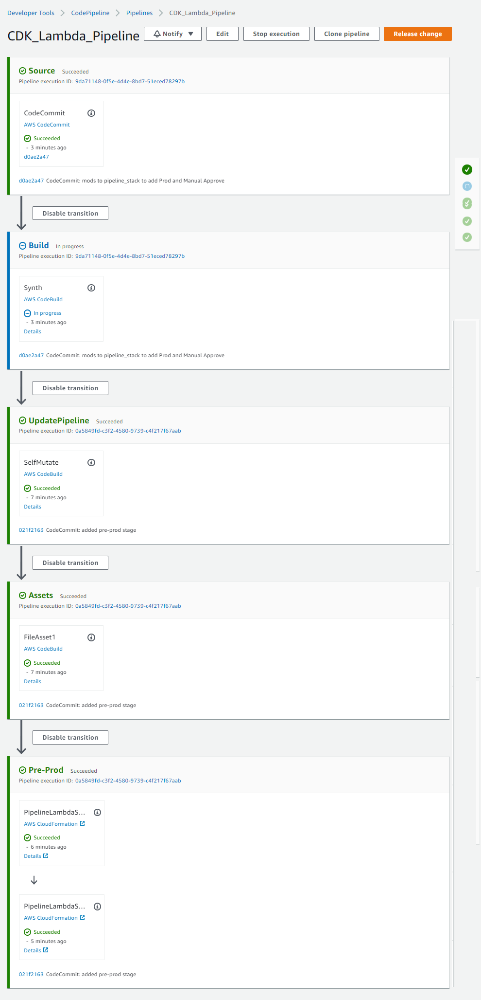
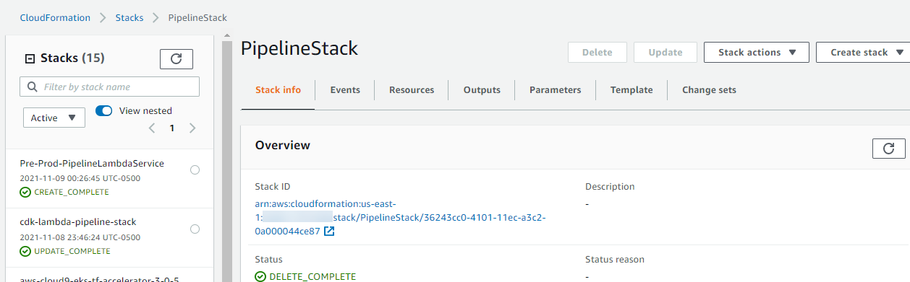

# Python CDK Pipeline for Continuous Delivery of AWS resources

This repository contains CDK Pipelines code that implements the following

- Deploys a self-mutating pipeline that monitors commits in the specified CodeCommit repo. This in turn kicks off the build and deploy phases
- Deploys CDK resource stack (pipeline_lambda_stack.py), which in this example is a simple Lambda function

When run, code creates the Cfn stack 'cdk-lambda-pipeline-stack', which in turn creates the initial CodePipeline and updates stack on future commits.

Code also kicks of the Cfn stack 'Pre-Prod-PipelineLambdaService', which deploys the contained Lambda and any other specified CDK resource.

## Steps to Install

- Clone this repo to a CodeCommit repo in same account where CDK Pipeline needs to be created.
- Add Account, Region, CodeCommit repository inputs in pipeline_stack.py and app.py files.
- Commit modifications to the CodeCommit repo
- Run 'pip install -r requirements.txt' to install Python requirements
- From root run 'cdk synth' followed by 'cdk deploy'
- The initial pipeline should be created.
- This is followed by the pipeline mutating to add in the Lambda stack (during the Pre-Prod pipeline stage)
- On conclusion, check the Cfn Lambda stack was created successfully.
- Check Cfn stack output to get the newly created Lambda ARN and verify Lambda existence
- **HINT**: If only the Lambda stack needs to be test deployed then run 'cdk deploy cdk-lambda-stack' after uncommenting line in app.py

## Final CodePipeline and Cfn Stack

## Credits

[Enhanced CI/CD with AWS CDK - AWS Online Tech Talks](https://www.youtube.com/watch?v=1ps0Wh19MHQ)

[SDK CodePipeline](https://docs.aws.amazon.com/cdk/api/latest/python/aws_cdk.aws_codepipeline.htmlhttps://docs.aws.amazon.com/cdk/api/latest/python/aws_cdk.aws_codepipeline_actions/README.htmlhttps://www.youtube.com/watch?v=1ps0Wh19MHQ)

[SDK CodePipeline Actions](https://docs.aws.amazon.com/cdk/api/latest/python/aws_cdk.aws_codepipeline_actions/README.htmlhttps://www.youtube.com/watch?v=1ps0Wh19MHQ)
